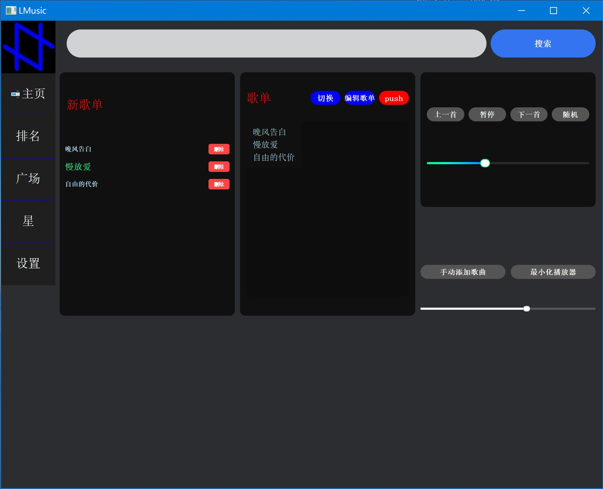
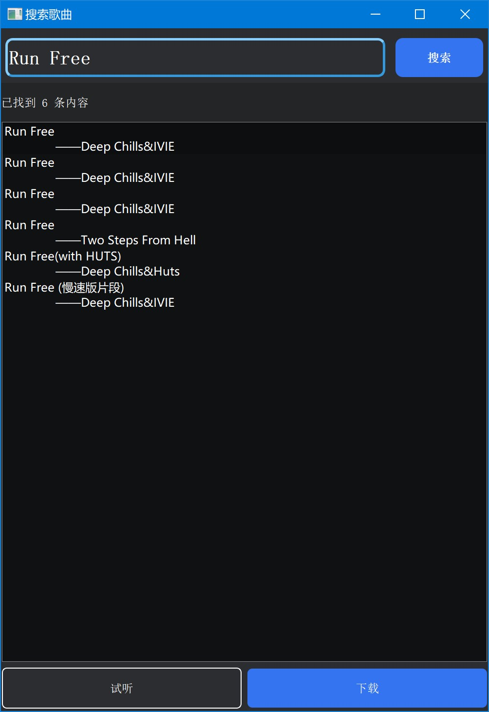

# LMusic

一个轻量级的免费开源音乐app，集成了歌曲搜索并下载、管理和播放等功能

## 快速开始

**你可以通过以下两种方式之一运行本项目：**

### 方式一：直接运行 EXE 文件（推荐非开发用户）

1. 前往 [Releases](https://github.com/lightyear2008/LMusic/releases) 页面下载最新版本的 `LMusic.zip`。
2. 解压下载的压缩包到你电脑上的任意位置。
3. 进入解压后的文件夹，双击运行 `LMusic.exe` 即可。

### 方式二：在 Python 环境中运行

#### 环境要求

- Python 3.8 或更高版本

- [Edge浏览器驱动](./drivers)对应版本的Edge浏览器（若此驱动较浏览器版本低，可手动替换，[查看替换教程](./drivers/update_driver_manual.md)）
1. **克隆项目**
   
   ```bash
   git clone https://github.com/lightyear2008/LMusic.git
   cd LMusic
   ```

2. **安装依赖**
   
   ```bash
   pip install -r requirements.txt
   ```

3. **运行程序**
   
   ```bash
   python main.py
   ```

## 功能特性

- **本地音乐播放** - 支持 MP3 格式
- **歌单管理** - 创建、编辑、切换不同歌单
- **多种主题** - 内置多种滑块等样式，支持自定义
- **歌曲搜索** - 自动联网搜索并下载歌曲到本地
- **现代化界面** - 暗色主题，圆角设计，平滑动画
- **轻量级应用** - 原始大小仅150MB，内存占用极低

## 界面预览

                  

## 文件说明

| 文件                       | 功能                                             |
| ------------------------ | ---------------------------------------------- |
| pages/                   | 主页左侧边栏按钮对应页面的py文件（包）                           |
| climber.py               | 所有网络爬虫函数                                       |
| searchbox.py             | 搜索框GUI                                         |
| dbcrudtool.py            | 已弃用的歌曲库操作工具                                    |
| dbcrudtool2.py           | 本地歌曲库操作工具                                      |
| edit_window.py           | 歌单管理窗口（点击主页的“编辑歌单”按钮弹出）                        |
| main_window.py           | 主窗口GUI，调用pages中的页面                             |
| switch_window.py         | “切换歌单”窗口，[预览界面](./screenshots/screenshot3.jpg) |
| drivers/                 | 存储浏览器驱动，供selenium调用                            |
| images/                  | 图像文件                                           |
| logs/                    | 日志文件                                           |
| mp3_db/main_list/        | 存储所有歌曲的MP3文件                                   |
| mp3_db/my_lists/         | 所有自建歌单的歌曲名及播放次数信息                              |
| mp3_db/main_db.txt       | 主歌单（包含目前本地所有歌曲）的歌曲名及播放次数信息                     |
| try_music/               | 临时下载的试听歌曲MP3文件                                 |
| config.ini               | 配置文件                                           |
| now_playing_message.json | 音乐播放线程的实时更新数据                                  |

- 以上是程序依赖的所有文件，正常运行必须

## 许可证

本项目使用[MIT License](./LICENSE)

## 版本日志

V1.0 - 2026.5.18 初始版本

## 免责声明

### 1. 技术合规性说明

本程序涉及的网络爬虫功能严格遵守目标网站的 `robots.txt` 协议。经确认，当前所爬取数据的网站其 `robots.txt` 文件中并未禁止本程序所采取的爬取行为。若未来目标网站修改其协议规则，本项目将立即调整或移除相关功能。

### 2. 版权与使用限制

- **仅供学习交流**：本软件及其开发者严格将本项目定位为**技术学习与研究工具**，旨在探索网页解析、自动化测试及本地音乐管理技术。**严禁任何形式的商业用途**。
- **禁止传播**：用户不得将下载的受版权保护的音乐文件进行二次分发、上传至公共网络或用于任何侵犯版权方利益的行为。

### 3. 责任豁免

- 本软件仅提供本地播放与管理框架，搜索功能依赖于第三方公开网站的可用性。若第三方网站改版、限制访问或产生法律纠纷，**开发者不承担因第三方服务变更导致的任何责任**。
- 若用户违反上述使用限制，将下载内容用于商业盈利、公开传播等侵权场景，**由此产生的全部法律责任由用户自行承担**，开发者不承担任何连带责任。
- 本项目为**开源免费软件**，不包含任何收费功能。使用本软件不构成开发者与用户之间的服务合同关系。

**使用本软件即表示您已阅读、理解并同意本免责声明的全部内容。**
